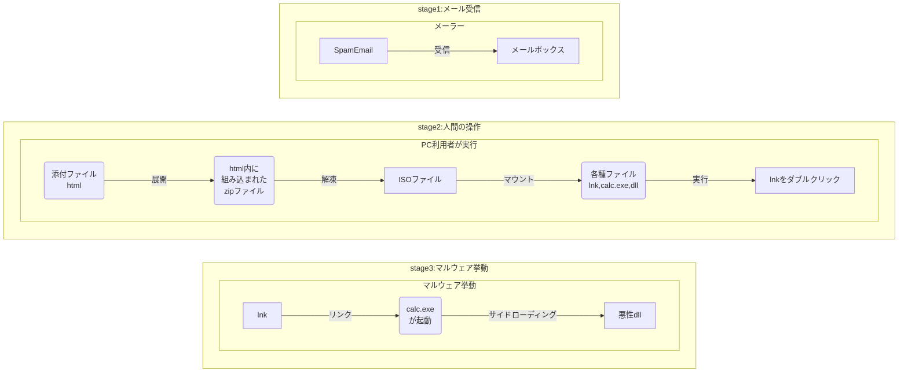
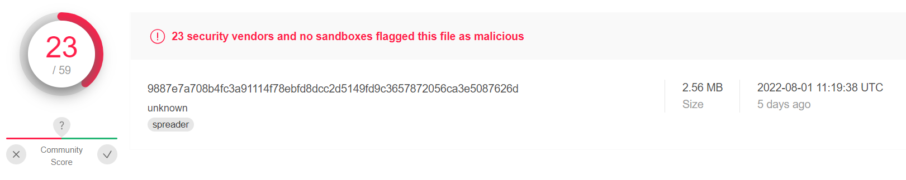
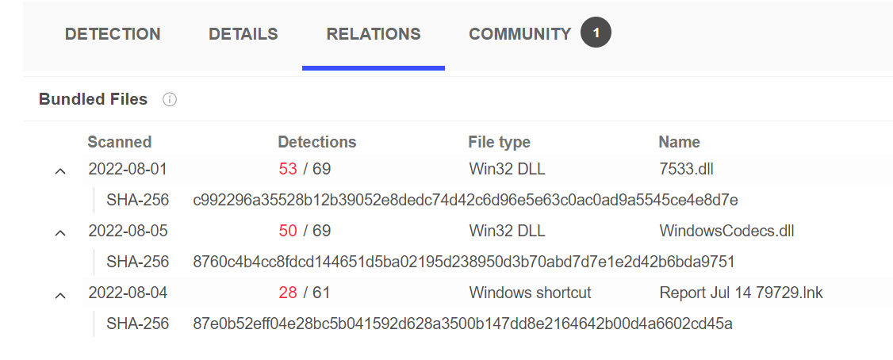
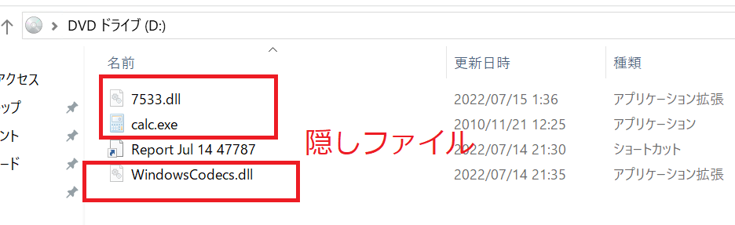
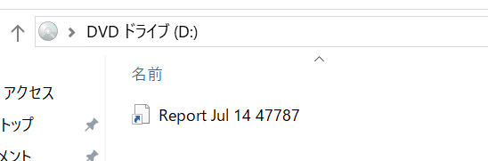
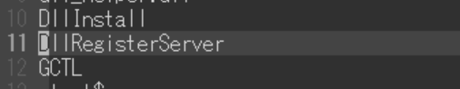
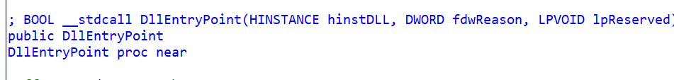
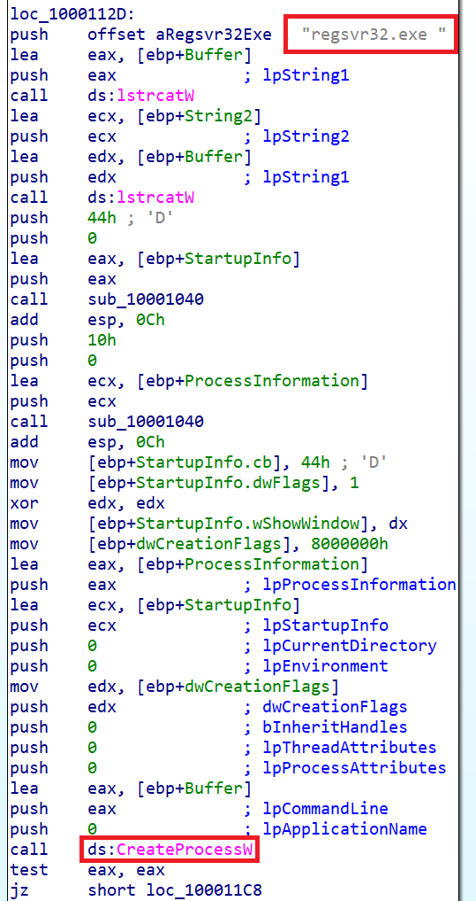
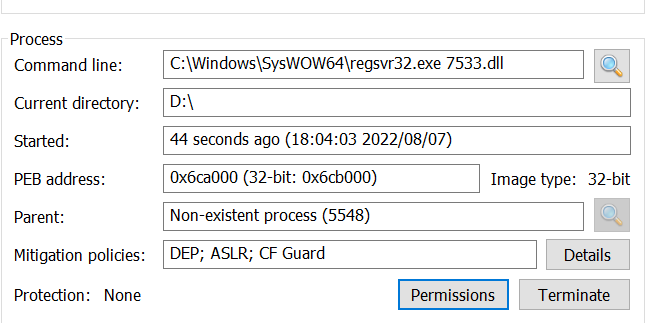

# QakBotを見てみる

最近、lnkファイルを使うマルウェアと同じくらいISOを使うマルウェアが多いですよね。IcedIDとかQakBotとか。他にもちょろちょろ出てます。  
で、QakBotですがこれに合わせてcalc.exeへのサイドローディングをする形をとっているようですので、ちょっと見てみたくなりました。  

元ネタはこちら。  
* https://blog.cyble.com/2022/07/21/qakbot-resurfaces-with-new-playbook/

正直、ここに素晴らしく情報乗ってるんですよね。なのではっきり言うとここみりゃいいじゃん、てなります。  
まぁ私は私でやってみましょう。  

### 全体の挙動

さっき紹介したサイトにしっかり乗ってます。


* 引用: https://blog.cyble.com/2022/07/21/qakbot-resurfaces-with-new-playbook/

さて、ちょっとだけ私が補足をさせていただきたいと思います。  



まぁ大した話ではないですね。単純に人が操作をしてしまう部分がどこかを書いただけです。  
こう見ると引っかかる部分は多いと思いますので、マルウェアの可能性を感じることも結構できるのでは？とは思いますね。  

さて、それでは実際にファイルを見ていきたいと思います。ちなみに以下のハッシュをmalware bazaarでダウンロードして試しました。

* cb83a65a625a69bbae22d7dd87686dc2be8bd8a1f8bb40e318e20bc2a6c32a8e
* https://bazaar.abuse.ch/browse.php?search=sha256%3Acb83a65a625a69bbae22d7dd87686dc2be8bd8a1f8bb40e318e20bc2a6c32a8e


### 実際に見てみる！

まずはhtmlファイルを見てみます。  

```html
var text = 'UEsDBBQAAAA～省略～CgAAAA==';
var content_type = 'application/zip';
var target_file_name = 'Report Jul 14 47787.zip';
```

わかりやすくzipファイルが仕込まれてますね。内容は単純なbase64なのでzipにしてみます。  

```bash
# sha256sum malware.zip
2107efaa6016ef4bb8df2ee27697a66e907928e36eb9443e3fafb739f43d82ae  malware.zip
```

さて、ではこのzipファイルを解凍してみましょう。  

```bash
$ unzip malware.zip
$ ls -la 3590
total 2632
drwxr-xr-x 2 root root    4096 Jul 14 20:09  .
drwxr-xr-x 4 root root    4096 Aug  7 03:58  ..
-rw-r--r-- 1 root root 2686976 Jul 14 20:06 'Report Jul 14 47787.iso'
$ sha256sum 3590/Report\ Jul\ 14\ 47787.iso
9887e7a708b4fc3a91114f78ebfd8dcc2d5149fd9c3657872056ca3e5087626d  3590/Report Jul 14 47787.iso
```

このISOファイルはvirustotalに情報がありました。結構検知されてますね。  


バンドルファイルも書かれてますが、中々のものですね。  


しかし、ちょっと驚いたのはcalcも一緒に仕込まれてると思ったらそうではない？かもですね。あとで実際に開いてみてみましょう。  

次に、このISOファイルをマウントしてlnkの中を見てみました。

```bash
$ lnkinfo iso/Report\ Jul\ 14\ 47787.lnk
lnkinfo 20181227
# ～省略～
    Local path                      : C:\Windows\System32\cmd.exe
    Command line arguments          : /q /c calc.exe
    Icon location                   : %ProgramFiles(x86)%\Microsoft\Edge\Application\msedge.exe
```

この内容を見るとcalc.exeは移動もさせずに実行ですね。そうなると、バンドルしてるかどうかがやはり鍵でしょう。  
あとiconはmsedgeですか。まぁlnkファイルを偽装しているわけですし、htmlっぽく見せるのが安心できそうではあります。  

さて、実際に開いてみてみました。  
そうするとまぁそうだろうな、と思いましたがlnkファイル以外は全て隠しファイルになっています。  


実際、隠しファイルを表示しない（一般的な状態）だとこんな感じ。これは騙されそうですね。。  


あと1つ、とても大事なこととしてやっぱりcalc.exeはバンドルされてますね！よかったです。これならわかります。

ちなみにバンドルされてるcalc.exeは以下です。
80c10ee5f21f92f89cbc293a59d2fd4c01c7958aacad15642558db700943fa22

2010/11/20 であり、かなり古いものですね。こういうサイドロードはよくあります。

さて、DLLは以下の2つがあります。これを見てみましょうか。  
まずは、WindowsCodecs.dllを見てみましょう。stringsをとってみます。  



そうすると気になるものがありますね。DllRegisterServerの関数名が見れます。  
これはregsvr32とかでDLLを登録するときとかの文言ですね。あと、このファイルはやたら容量が小さいです。  
次に、IDA Proを使ってもう少し見てみましょうか。  
* IDAPro: https://hex-rays.com/ida-free/

まずは、以下でDllEntryPointの関数呼び出しからregsvr32の呼び出しが行われています。  





もう1つのファイル、7533.dllはこれで呼び出されるように思われますね。  
こう考えると他の動きがないですし、WindowsCOdecs.dll+calc.exeの挙動は最初だけですぐに使われなくなるようです。  

実際、実行してみると確かにそのように動作しています。  

    

あとは7533.dllですが。正直面白そうな情報は見当たらなかったので一旦終了とさせていただきます。ちなみにtria.geなどにかけてみましたが、重くとまともに動かない。。なぜだろう？？  

次はいい感じに動くことを祈ります。。  

