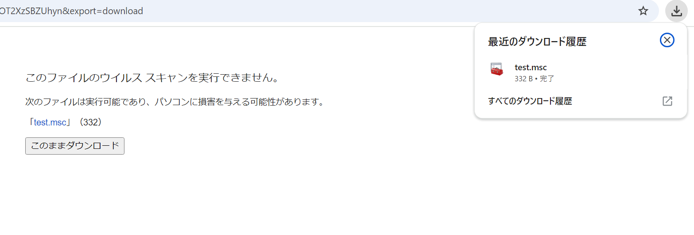
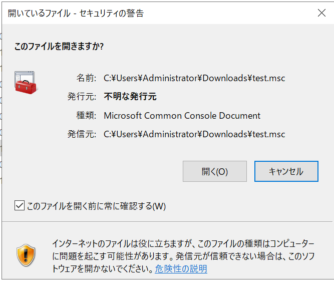
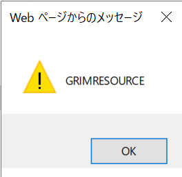
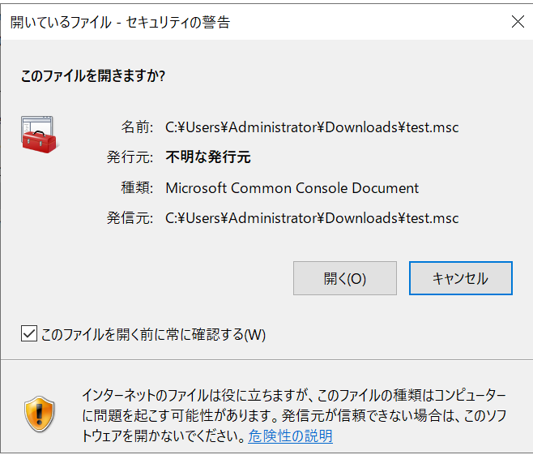
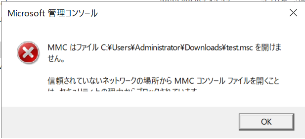
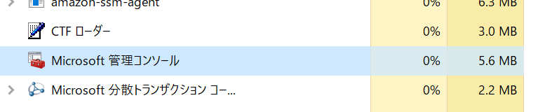

# GrimResourceに関する追加の確認

Microsoftの2024年10月のパッチチューズデーでMSCファイルによる攻撃をブロックするように変わりました。  
MotWがついているとブロックするようですので、その点も踏まえ、動作を確認します。  
まず、テスト用のMSCファイル(test.msc)を作成します。

```xml
<?xml version="1.0"?><MMC_ConsoleFile ConsoleVersion="3.0" ProgramMode="UserSDI">
  <StringTables>
    <StringTable>
      <Strings>
        <String ID="39" Refs="1">res://apds.dll/redirect.html?target=javascript:eval("alert('GRIMRESOURCE')")</String>
      </Strings>
    </StringTable>
  </StringTables>
</MMC_ConsoleFile>
```

これをGoogle Driveからダウンロードさせ、MotWがついていることを確認します。  



dir /rの結果が以下です。

```
> dir /r
# 省略
2024/10/10  12:52               332 test.msc
                                186 test.msc:Zone.Identifier:$DATA
# 省略
```

この上で、実行して試してみましょう。

## 実行テスト

まずは、アップデート前に確認します。

### アップデート前

アップデート前は、警告は表示されますが、その後にJavaScriptのアラートが実行されます。  

- 警告  


- JavaScriptが実行され、メッセージが表示  


これは想定通りの状況です。

### アップデート後

アップデート後は、警告が表示され、OKクリック後もJavaScriptは起動せず、実行エラーになります。

- 警告  


- 実行エラー



なお、アップデート後はMotWがついていなくても、実行できない状態でした。  
この場合は、エラーは出ず、バックグラウンドプロセスとして起動だけしている状態になっています。  



## 結論

MSCはGrimResource攻撃が報告されたころから多くの攻撃が観測されていました。  
MotWがついていても警告のみで実行させ、任意のスクリプト実行ができることから人気があったものと思います。  
しかしこの攻撃手法は、今回の修正で今までの様には悪用できなくなりました。  

次にどのような攻撃が行われるようになるか、よく注視する必要がありますね。  

