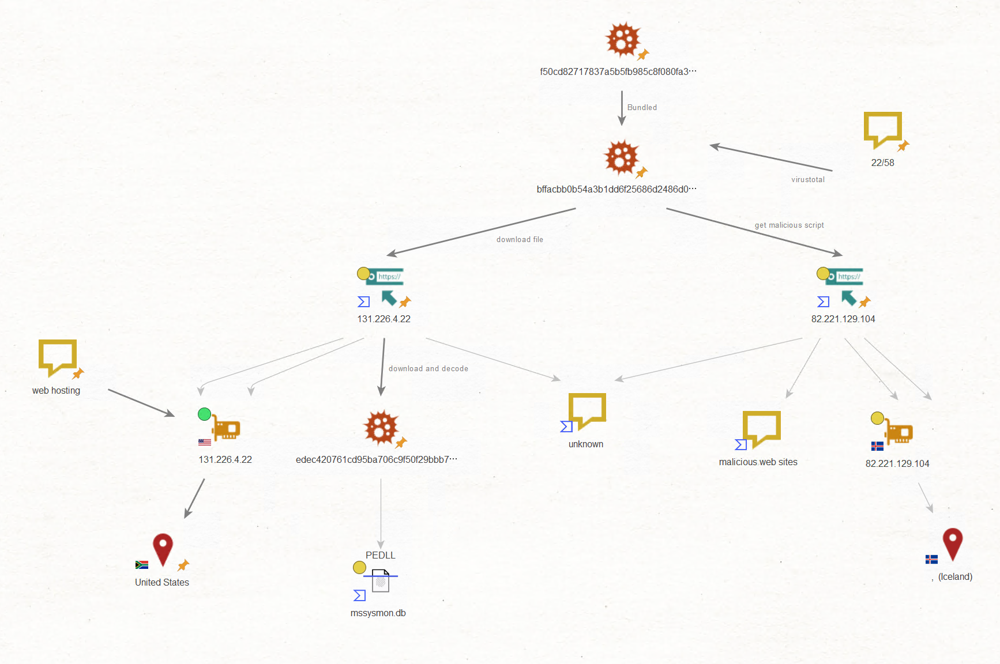

# Lnkファイルベースのマルウェアに関するmaltego分析

maltegoという分析用ツールがあります。これを使って諸々調査を行ってみました。  
とりあえず、以前以下で分析したlnkベースのマルウェアについてです。  

[Lnkタイプのマルウェアを解析](https://blog.tech-oshiba.com/2022/06/30/lnk%e3%82%bf%e3%82%a4%e3%83%97%e3%81%ae%e3%83%9e%e3%83%ab%e3%82%a6%e3%82%a7%e3%82%a2%e3%82%92%e8%a7%a3%e6%9e%90/)

とはいえ、マルウェアを実際にダウンロードなどしていないため、正直だいぶ緩い内容になってます。  
まぁ今後のためのアウトプットとして、ということで。  

ペイロードファイルのダウンロードに使われたのは、Webホスティングサービス上でのホストのようです。  
このパターン、本当に多いですね。。  

この先ももう少し動かしてみたいところですが、今のところはまだテストできてません。というのも動的解析について環境構築がほぼできていないのですよね。  
今後、追記があればやるかもしれません。

あと、`lnkmalware_220603.mtgl`でmaltegoグラフファイルもアップしました。  

短いですが、これで終わります。ありがとうございました。  
