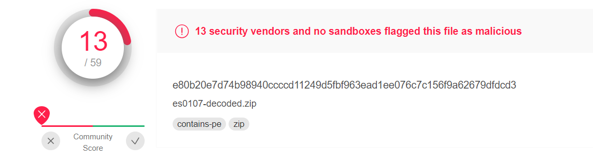
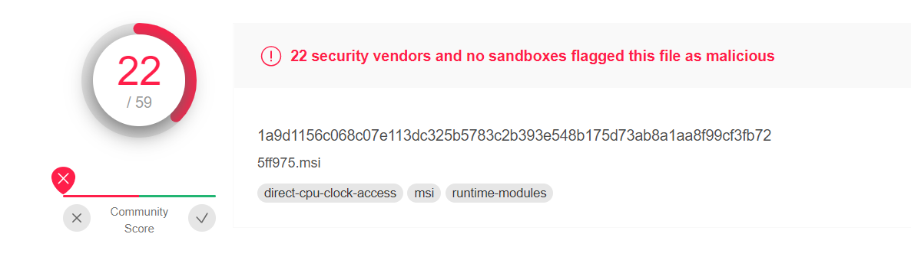
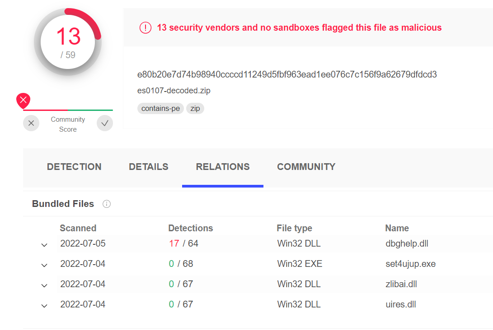
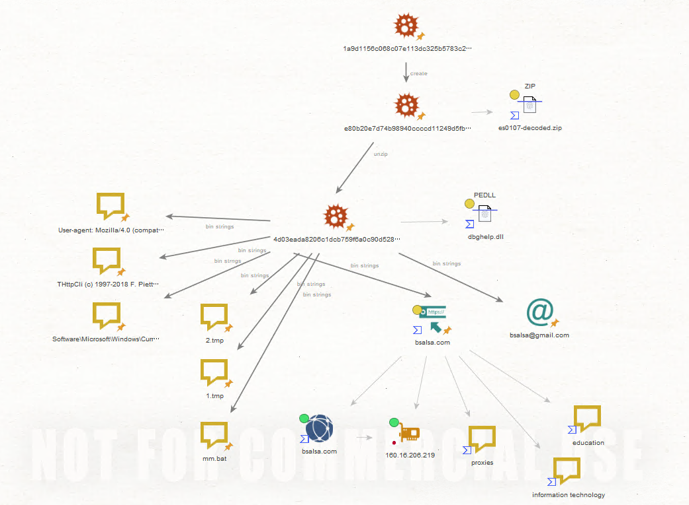

# MSIベースのマルウェアを確認

### 概要

またまたTwitterですが、マルウェア情報が来たので調査してみようと思いました。  
対象のマルウェアは以下になります。  

e80b20e7d74b98940ccccd11249d5fbf963ead1ee076c7c156f9a62679dfdcd3



ちなみに情報源は以下のtweetです。  
https://twitter.com/StopMalvertisin/status/1543980678123257856

### 解析内容

まず、twitterで流れてきたマルウェア名が以下になっています。  
- Javali
- Ousaban

どうやらどちらもバンキングトロイのようです。  
virustotalで見る限りは同様の検知はなし。malwarebazaarで見る限りはこのtweet元と同じ情報だけですね。  

このファイルですが、大本はMSIファイルからの実行のようです。  



さらに、es0107-decoded.zipを解凍すると以下のファイルが存在します。この中で、`dbghelp.dll`が悪性のようですね。  



併せて入っているEXEが存在することと、この`dbghelp.dll`はWindowsデバッグツールに存在するDLLであることを考えると、おそらくはサイドローディングの脆弱性を利用しているのではないかと思います。  

https://docs.microsoft.com/ja-jp/windows/win32/debug/dbghelp-versions

Note: そういえば、昔はサイドロードはDLLハイジャックと読んでたような気がしますが、いつの間に変わったんですかね？記憶違いか？  

さて、次にこのdbghelp.dllを[flare-floss](https://github.com/mandiant/flare-floss)を使って可読文字を読んでみます。  

そうすると色々興味深い情報が出ます。以下に列挙しますね。  
**重要** マルウェアも様々なライブラリを利用しますので、以下は全て悪性の情報というわけではありません！

```
bsalsa@gmail.com
http://bsalsa.com/
THttpCli (c) 1997-2018 F. Piette V8.57
User-agent: Mozilla/4.0 (compatible; MSIE 6.0; Windows NT 5.1; SV1)(
mm.bat
1.tmp
2.tmp
Software\Microsoft\Windows\CurrentVersion\Run
```

メールアドレスやURLが存在するため、この辺りはちょっと調べてみたいですね。ということで調べてみると以下のGitHubページなどが出てきます。  

https://github.com/ghquant/Delphi-EmbeddedWB/blob/master/Source/EwbEditors.pas

どうやら、このbsalsaというものはWeb系のライブラリのようです。その他の情報もないですし、残念ながら攻撃系ではなさそう、ですね。
`THttpCli`については、残念ながらあまり情報がなくはっきりとはわかりませんでした。  
Google検索をしてみるとHybridAnalysisの情報などが出てきますが。。これも同じようにライブラリ系かな？と思えます。

https://hybrid-analysis.com/sample/a15921012a196af6e28f8a07c833df18323d65a9c1d7f8807a269604dc393c0f?environmentId=100&lang=it

さて、次にUser-Agent情報があります。これはちょっと気を止めておいた方がいいかもしれませんね。とはいえあまり特徴的ではないUAですが。  

今度はファイル名です。これは正直、一時ファイルの名称ですし、フォルダもわからないので、わかりかねるところがあります。  
`mm.bat`だけは感染していないかどうか調べるのにいいかもしれませんね。  

さて、最後は少し特徴的です。これは永続性の設定ですね。HKCUかHKUかHKLMかわかりませんが、Runの下に知らないアプリケーションの設定がないかどうか調べるのは有意義そうです。  
`Software\Microsoft\Windows\CurrentVersion\Run`

さて、残念ながら通信情報などに関する有意義な情報は見当たりませんでした。

### maltegoグラフ

最後に、この調査内容についてグラフにしました。  



うーん。調査内容からの追加情報があまりないので微妙なところがありますが。  

さて、この内容で終了となります。ありがとうございました。  
